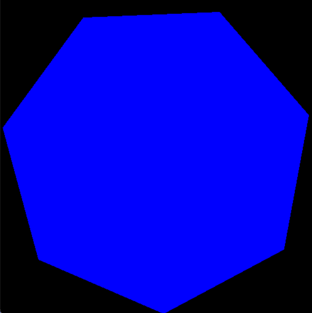

# PyOpenGL_SimpleShape
 ## A simple OpenGL program, which renders a RGB triangle into a window.

 ## A simple OpenGL program, which renders two blue triangles into a window.
 ### Using GL_TRIANGLES

 ## A simple OpenGL program, which renders two triangles and make it a square into a window.
 ### Using GL_TRIANGLES

 ## A simple OpenGL program, which renders polygon shape into a window.
 ### Using GL_TRIANGLE_FAN
 
